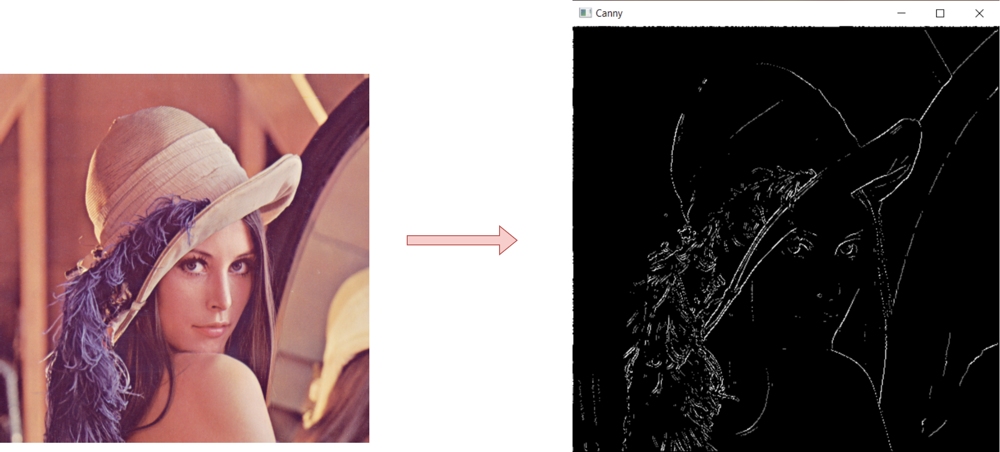

# Canny Edge Detector

This repository contains an implementation of the Canny Edge Detection Algorithm in C++ using the OpenCV library. The program includes various custom functions for image processing, such as pooling, convolution, Sobel filtering, Gaussian kernels, and thresholding. These building blocks are used to achieve edge detection as described in the Canny algorithm.

## Features

The project implements the following functionalities:

- Max Pooling: Down-samples an image by selecting the maximum value in each window. 
- Average Pooling: Down-samples an image by averaging the values in each window. 
- Convolution (Float and Integer): Applies kernels to the image for filtering and feature extraction. 
- Gaussian Kernel Generation: Generates a 1D Gaussian kernel for smoothing. 
- Sobel Filtering: Computes the gradient magnitude and orientation for edge detection. 
- Bilinear Interpolation: Performs interpolation to find pixel values at non-integer coordinates. 
- Non-Maximum Suppression: Suppresses non-peak gradient magnitudes to thin edges. 
- Hysteresis Thresholding: Classifies pixels as edges based on high and low thresholds. 
- Canny Edge Detection: Combines all the above steps to detect edges in an image.

    

## Requirements
- C++ Compiler: Compatible with C++11 or later.
- OpenCV Library: Version 3.0 or later.
- CMake: For building the project.

## Usage

Clone this repository:

    git clone https://github.com/fabiolapasini/Canny-Edge-Detector.git
    cd Canny-Edge-Detector

Build the project:

    mkdir build
    cd build
    cmake ..
    make

Run the executable:

    ./CannyEdgeDetector

Place the test image (Lenna.png) in the same directory as the executable, or modify the code to specify a different image path.

## Code Structure

1) Image Pooling:
    - maxPooling: Implements max pooling.
    - averagePooling: Implements average pooling.

2) Convolution:
    - convFloat: Performs convolution with floating-point precision.
    - convInt: Performs convolution and scales the output to integer values.

3) Gaussian and Sobel Filters:
    - gaussianKernel: Generates a 1D Gaussian kernel for smoothing.
    - sobelFilter: Computes gradient magnitude and orientation using Sobel kernels.

4) Edge Detection:
    - findPeaks: Implements non-maximum suppression to thin edges.
    - doubleTh: Applies hysteresis thresholding.
    - cannyEdgeDetector: Combines all the steps to perform edge detection.

5) Utilities:
    - bilinearInterpolation: Calculates interpolated pixel values for sub-pixel accuracy.

## Acknowledgments

The implementation is based on the principles of the Canny edge detection algorithm.
OpenCV library is used for basic image handling and visualization.

## License

This project is licensed under the MIT License. See the LICENSE file for details.
Feel free to modify this implementation to suit your specific needs or to experiment with different kernels and parameters for custom edge detection!